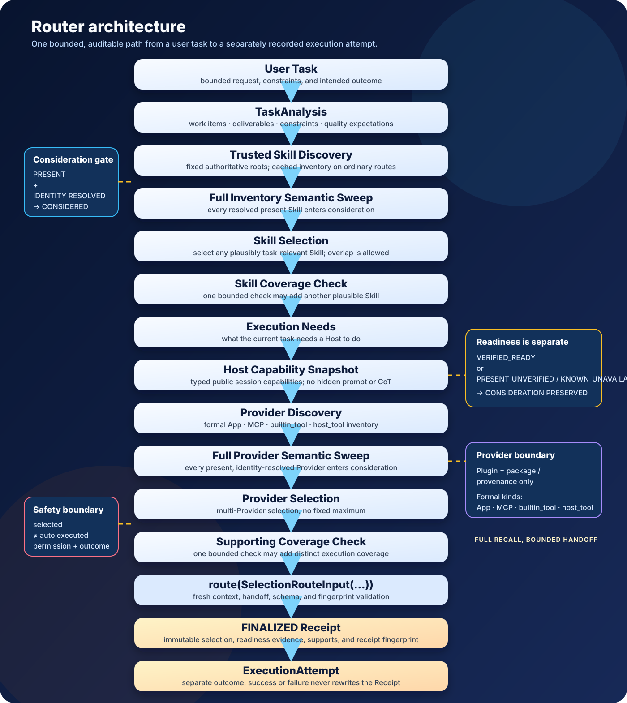

# Codex Capability Router

[繁體中文](README.md) | English

> Help Codex understand the whole task first, then find the Skills and Supporting Providers that genuinely help.

Codex Capability Router is a local-first, context-first, read-only capability router. It turns a natural-language task into an auditable <code>TaskAnalysis</code>, discovers trusted Skills, observes the Supporting Providers exposed by the current session, and uses the formal <code>route(SelectionRouteInput(...))</code> entry point to produce a <code>FINALIZED</code> Receipt that execution failures cannot silently rewrite.

Current version: <code>0.2.0-beta.9</code>. Compatibility baseline: <code>0.1.0</code>; Phase 1 remains <code>read-only</code>, performs no network discovery, and does not emit a private capability inventory.

Beta9 also fixes Skill source binding and handoff freshness: one canonical Skill may retain multiple authoritative provenance sources, but each logical routing decision selects one deterministic physical source. The profile, fingerprint, and handoff all bind to that same source. If a selected Skill changes between snapshot and handoff, the Router performs one targeted refresh, creates a new immutable snapshot, and retries once; a second mismatch returns <code>HANDOFF_REJECTION</code>, while a changed selection-visible semantic digest returns <code>SELECTION_REVALIDATION_REQUIRED</code> to the Host controller.

## Why Capability Router?

A compound task may need documentation, code checks, visual production, a workflow diagram, and repository validation at the same time. An older flow often looked like this:

~~~text
discovered → top-k shortlist → selected
~~~

That can give a useful tail capability no chance to reach semantic consideration. The current Router uses:

~~~text
trusted discovery inventory
        ↓
deterministic bounded semantic sweep
        ↓
every resolved present capability gets at least one consideration
        ↓
any plausibly task-relevant capability enters selection
~~~

The key invariants are:

- <code>skill_never_considered_total = 0</code>
- <code>provider_never_considered_total = 0</code>

These are design goals for reducing discovery and consideration misses, not a claim that every future capability can never be missed. On the trusted, formally discoverable inventory, the Router preserves auditable evidence for discovery, consideration, selection, and constraints.

The four principles are:

**DISCOVER BROADLY**: collect the trusted inventory before narrowing it.
**CONSIDER BROADLY**: give every resolved present capability a semantic consideration opportunity.
**SELECT GENEROUSLY**: keep any capability with plausible task-relevant value instead of excluding it because it overlaps another Skill or another tool already covers the work.
**EXECUTE CAREFULLY**: routing is a recommendation and handoff boundary, not automatic execution, installation, login, or authorization.

## Core capabilities

| Capability | What it does |
| --- | --- |
| <code>TaskAnalysis</code> | Breaks the request into work items, material deliverables, constraints, and quality expectations. |
| Skill routing | Discovers Skills from trusted roots, runs a full-inventory semantic sweep, and selects method-oriented capabilities. |
| Supporting Provider routing | Uses <code>HostCapabilitySnapshot</code> to identify formal App, MCP, <code>builtin_tool</code>, and <code>host_tool</code> capabilities. |
| High-recall selection | Uses no fixed top-k and no fixed Skill count; any plausibly task-relevant capabilities may be selected together. |
| Auditable Receipt | <code>route(SelectionRouteInput(...))</code> returns <code>FINALIZED</code>, a fingerprint, and selection evidence. |
| Read-only boundary | The Router does not execute endpoints, perform network discovery, install or authorize tools, or read hidden prompts or chain-of-thought. |

## Four principles, four views

### Discover broadly: make the inventory visible

The cat uses a magnifying glass to inspect capability cards arriving from every direction. The scene represents a complete inventory sweep, including useful tail capabilities. Discovery comes first; any identity-resolved present record can enter semantic consideration, while metadata quality remains diagnostic.

### Select generously: keep real value

The dog keeps multiple capabilities that may help on the workbench; only clearly irrelevant, exact-duplicate, or safety-blocked items go aside. Selection is not a contest to minimize the count; it is a way to avoid missing useful task support.

### Multi-provider + safe execution: selected is not executed

Multiple Providers can be selected together. Actual execution still belongs to an external execution layer with permissions and error handling. The shield and Receipt represent <code>selected ≠ auto executed</code>, as well as the boundary between <code>SELECT GENEROUSLY</code> and <code>EXECUTE CAREFULLY</code>.

### Architecture: from task to Receipt

The complete flow is:

~~~text
User Task
  ↓
TaskAnalysis
  ↓
Trusted Skill Discovery
  ↓
Full Inventory Semantic Sweep
  ↓
Skill Selection
  ↓
Skill Coverage Check
  ↓
Execution Needs
  ↓
Host Capability Snapshot
  ↓
Provider Discovery
  ↓
Full Provider Semantic Sweep
  ↓
Provider Selection
  ↓
Supporting Coverage Check
  ↓
route(SelectionRouteInput(...))
  ↓
FINALIZED Receipt
  ↓
ExecutionAttempt
~~~

## Skill, Provider, and Plugin

| Term | Role | Router boundary |
| --- | --- | --- |
| Skill | A method and quality specification for how to do the work, such as technical writing, verification, or image generation. | Found by trusted Skill discovery, considered semantically, and potentially selected. |
| Provider | A formal capability that can support an execution need, such as an App, MCP, <code>builtin_tool</code>, or <code>host_tool</code>. | Found by runtime/provider discovery; presence, identity, and metadata enter consideration, while readiness remains execution evidence. |
| Plugin | Package and provenance information. | Not a formal Provider and must not be treated as a directly executable endpoint. |

The formal Provider kinds are <code>app</code>, <code>mcp</code>, <code>builtin_tool</code>, and <code>host_tool</code>. A generic execution capability does not automatically displace a specialized image, diagram, or verification Provider. If each has plausible task-relevant value, multi-selection is allowed; overlap and redundancy are not exclusion reasons. A Plugin remains package/provenance information, not a formal Provider.

App runtime evidence depends on whether the current Host/runtime source is available. A package declaration can preserve existence evidence, but the Router does not promise that every Host exposes a runtime app/list, and it does not turn a package declaration into a claim that a UI or endpoint is currently usable.

## Discovery roots, Plugin paths, and Skill inventory cache

Skill discovery uses authoritative known roots only. The fixed global roots are <code>$HOME/.agents/skills</code> and <code>$CODEX_HOME/skills</code>. <code>$CODEX_HOME/skills/.system</code> is the only explicitly legitimate SYSTEM known child under the second root; it is not a third independent global root and does not authorize recursive traversal of every hidden directory.

Plugin discovery resolves the logical Plugin inventory to a deterministic exact package root, reads the exact manifest, and follows only its manifest-declared Skill container or direct Skill path. The shared Plugin cache ancestor is never treated as a recursive search root; Skill directories under a container are inventory entities, not separate root-plan nodes.

At initialization or explicit source/plugin/project/runtime invalidation, the controller builds a <code>RootPlanSnapshot</code> and refreshes a <code>SkillInventorySnapshot</code>. When the caller/session source state is unchanged, an ordinary route reuses that snapshot: it does not rebuild the root plan, rescan the Skill filesystem, reopen Plugin manifests, or reopen every <code>SKILL.md</code>. This is a caller/session-owned cache, not a permanent cross-process persistent cache.

## Host Capability Snapshot

The Codex controller already knows which public capabilities the current session exposes. The Router receives their metadata through the typed <code>HostCapabilitySnapshot</code>, so “visible to the Host” and “available for Router consideration” share the same public capability boundary.

A snapshot can describe a capability ID, kind, display name, summary, readiness, and provenance. It does not read a hidden prompt or chain-of-thought, and it does not pretend to have cryptographic trust proof. <code>trusted_host_snapshot</code> is a trust marker for the input envelope, not a cryptographic claim.

Common readiness states:

| Readiness | Meaning | Selectable? |
| --- | --- | --- |
| <code>VERIFIED_READY</code> | Availability has supporting verification evidence. | Yes |
| <code>PRESENT_UNVERIFIED</code> | The Host exposes the capability and its metadata is sufficient, but this run has no endpoint readiness proof. | Yes |
| <code>KNOWN_UNAVAILABLE</code> | The capability is currently known not to run; the state is preserved for the execution boundary. | It may still enter semantic consideration; execution reports unavailable. |

<code>PRESENT_UNVERIFIED</code> is therefore not a discovery miss and not a promise of execution success. It is an auditable, selectable state whose actual result must be recorded by the execution layer.

Disabled, <code>callable=false</code>, auth-required, disconnected, unknown readiness, and sparse/opaque metadata must not hide an existing identity-resolved capability before semantic consideration. An unknown Host hierarchy remains visible as <code>host_tool</code>; it is not guessed into App, MCP, or another Host kind.

The Codex / Host main model owns TaskAnalysis, semantic Skill selection, Execution Needs, and semantic Provider selection. The Python Router owns deterministic discovery, identity normalization, validation, fingerprinting, handoff safety, and Receipt finalization. Python does not call an LLM from a raw prompt, and it does not replace Host reasoning with keyword mapping, semantic ranking, or an overlap winner.

## High-recall discovery and selection

The current flow processes the inventory in deterministic, bounded sweep batches instead of truncating it to an old top-k shortlist. Every resolved present Skill and formal Provider gets at least one semantic consideration; metadata quality and readiness remain diagnostic, and consideration does not imply selection.

Selection policy:

- There is no fixed Skill count.
- Any Skill with plausible value for any part of the task may be selected; weak relevance, redundancy, overlap, and another Skill already being sufficient are not exclusion reasons.
- There is no fixed Skill maximum and no top-k semantic truncation; multiple Skills may be selected whenever each may plausibly help the task.
- When a capability is uncertain but plausibly useful, the tie-break is SELECT.
- At most one bounded <code>Skill Coverage Check</code> may add a relevant Skill, including one that overlaps an already selected Skill.
- Selection is not replaced by keyword-to-ID mapping, handwritten selection, synthetic records, or Python-only semantic judgment.

The selection policy is <code>ANY PLAUSIBLE TASK-RELEVANT VALUE → SELECT</code>, but it is not blind selection of everything. Clearly irrelevant, exact canonical duplicates, explicitly constrained, or safety-boundary-blocked capabilities may still be excluded. Semantic redundancy is diagnostic, not semantic deduplication.

## Skill source binding and freshness recovery

One canonical Skill may have multiple authoritative physical sources. Beta9 retains that provenance but chooses one deterministic selected source; the current logical profile, profile fingerprint, handoff path, handoff instructions, and handoff fingerprint all derive from the same source. This prevents a profile from using Source A while handoff uses Source B.

An ordinary route does not turn freshness policy into full Skill polling. Only a fingerprint mismatch during full handoff of a selected Skill triggers one bounded targeted refresh: the known authoritative source for that Skill is revalidated, a new immutable inventory snapshot is created, and handoff is retried once. A second mismatch returns <code>HANDOFF_REJECTION</code>. If the selection-visible semantic digest changed, the Router returns <code>SELECTION_REVALIDATION_REQUIRED</code> to the Host controller rather than silently reselecting in Python.

### Capability miss taxonomy

The Router does not collapse every failure into <code>NO MATCH</code>:

| Category | Meaning |
| --- | --- |
| <code>DISCOVERY_MISS</code> | The trusted inventory did not discover a record that should have been formally discoverable. |
| <code>SEMANTIC_CONSIDERATION_MISS</code> | A discovered, identity-resolved present record never entered semantic consideration. |
| <code>BASE_SELECTION_MISS</code> | A capability was considered but a plausible base selection was missed. |
| <code>COVERAGE_CHECK_MISS</code> | A coverage check failed to add an explicit, necessary coverage capability. |
| <code>HANDOFF_REJECTION</code> | A later handoff or execution boundary rejected the selection. |
| <code>EXPLICIT_NEGATIVE</code> | The user or task explicitly ruled out the capability. |
| <code>CONSTRAINT_EXCLUSION</code> | A clear safety, environment, or other constraint excluded the capability. |

For this acceptance, the target on the current trusted, formally discoverable inventory is <code>Relevant Skill Miss = 0</code>, <code>Relevant Provider Miss = 0</code>, <code>Discovery Miss = 0</code>, and <code>Semantic Consideration Miss = 0</code>. Clearly irrelevant capabilities are not counted as misses.

## Installation

### Windows / PowerShell

Paste the following into PowerShell. It uses the current user’s <code>~/.agents/skills</code> location and contains no private absolute path:

~~~powershell
$skillRoot = Join-Path $HOME ".agents\skills\codex-capability-router"
if (Test-Path $skillRoot) {
    if (-not (Test-Path (Join-Path $skillRoot ".git"))) {
        throw "Target exists and is not a Git checkout: $skillRoot"
    }
    git -C $skillRoot pull --ff-only
} else {
    New-Item -ItemType Directory -Force -Path (Split-Path $skillRoot) | Out-Null
    git clone https://github.com/Lzxpan/codex-capability-router.git $skillRoot
}
python -m unittest discover -s (Join-Path $skillRoot "tests") -p "test_*.py"
python -m compileall -q (Join-Path $skillRoot "codex_capability_router") (Join-Path $skillRoot "tests")
~~~

### macOS / Linux

Paste the following into a POSIX shell. <code>${HOME}</code> expands to the current user’s home directory:

~~~bash
skill_root="${HOME}/.agents/skills/codex-capability-router"
if [ -e "$skill_root" ]; then
    if [ ! -d "$skill_root/.git" ]; then
        printf '%s\n' "Target exists and is not a Git checkout: $skill_root" >&2
        exit 1
    fi
    git -C "$skill_root" pull --ff-only
else
    mkdir -p "$(dirname "$skill_root")"
    git clone https://github.com/Lzxpan/codex-capability-router.git "$skill_root"
fi
python -m unittest discover -s "$skill_root/tests" -p "test_*.py"
python -m compileall -q "$skill_root/codex_capability_router" "$skill_root/tests"
~~~

Python 3.11 or newer is required. The package has no runtime dependencies; the tests use the Python standard library. If the target already exists but is not a Git checkout, the command stops rather than overwriting it.

## Quick Start

### A. A simple task

~~~text
Rewrite this release note into three clear, user-facing points.
Keep version numbers and API names unchanged, then list anything uncertain.
~~~

The Router builds one task understanding and selects every Skill with plausible value for any part of the task. Clearly irrelevant capabilities remain excluded; overlap and redundancy are not exclusion reasons.

### B. A compound engineering task

~~~text
Inspect this repository’s configuration parser, add the missing regression test,
check Python syntax and tests, and explain which external toolchain checks were not run.
~~~

This may select several Skills at once, such as repository survey, implementation-aware verification, testing, and technical explanation. Any Skills with plausible task-relevant support may be selected together; overlap and redundancy do not impose a selection limit.

### C. Image + documentation + repository validation

~~~text
Rework the Chinese and English READMEs, create original hero, feature-comic,
and architecture visuals with a consistent character style, then validate local links,
image references, UTF-8, U+FFFD, privacy, and test results. Report a sanitized
FINALIZED Receipt and any hardware or external checks that remain unverified.
~~~

This can use multi-Skill + multi-Provider routing: technical writing, visual explanation, image generation, repository verification, and session-exposed <code>builtin_tool</code> capabilities. The examples do not specify capability IDs.

## Sanitized Receipt example

The following is an illustrative/sanitized structural example with private paths, credentials, hidden prompts, and chain-of-thought removed; its numbers are not live inventory or UI expected constants:

~~~json
{
  "selection_state": "FINALIZED",
  "task_analysis": {
    "work_items": 5,
    "material_deliverables": 9,
    "constraints": 5,
    "quality_expectations": 5
  },
  "skills": {
    "discovered": 550,
    "available": 549,
    "semantically_considered": 549,
    "never_considered": 0,
    "plausible": 8,
    "selected": 8
  },
  "supporting_providers": [
    {"kind": "builtin_tool", "readiness": "PRESENT_UNVERIFIED"},
    {"kind": "builtin_tool", "readiness": "PRESENT_UNVERIFIED"},
    {"kind": "builtin_tool", "readiness": "PRESENT_UNVERIFIED"},
    {"kind": "builtin_tool", "readiness": "PRESENT_UNVERIFIED"}
  ],
  "provider_metrics": {
    "host_snapshot_capabilities": 4,
    "discovered": 4,
    "metadata_sufficient": 4,
    "semantically_considered": 4,
    "never_considered": 0,
    "plausible": 4,
    "selected": 4
  },
  "receipt": {
    "fingerprint": "481ac81362e19674a5fbc1023cefdeb74377d4de002e4a43f9f9cb48ab8d32d0"
  }
}
~~~

<code>FINALIZED</code> means the selection route completed with a traceable Receipt. It does not mean that every Provider endpoint succeeds in every environment.

The Selection Receipt is finalized once by <code>route()</code>; an external <code>ExecutionAttempt</code> is separate immutable outcome evidence and cannot rewrite the finalized Receipt.

## Safety and execution boundary

- The Router is a read-only routing library, not a workflow engine.
- <code>route(SelectionRouteInput(...))</code> creates selection and Receipt data; it does not call selected endpoints.
- It does not automatically perform network discovery, OAuth, login, installation, flashing, release, or publishing.
- Trusted discovery, metadata sufficiency, readiness, and execution outcome remain separate evidence.
- If an external layer attempts a capability, it should create an <code>ExecutionAttempt</code> and record success, failure, blocked, or unavailable honestly. Execution failure must not be hidden inside selection.
- The Router does not read hidden prompts, chain-of-thought, credentials, or private capability inventories.

## Current limitations

- The Router is beta; the selection and Receipt schemas may evolve.
- <code>PRESENT_UNVERIFIED</code> means a capability is publicly exposed with sufficient metadata. It does not prove endpoint, permission, network, or third-party availability.
- The Router does not execute external tools or perform hardware, flashing, GPIO, UART, sensor, or real-device acceptance.
- The <code>never_considered = 0</code> guarantee is bounded to the trusted, identity-resolved, formally discoverable present inventory and its bounded sweep; metadata quality is diagnostic, not a universal guarantee about an unknown outside world.
- <code>RootPlanSnapshot</code> and <code>SkillInventorySnapshot</code> are caller/session-owned caches. They refresh on source or explicit controller-state changes; they are not permanent cross-process caches.
- A selected-Skill freshness mismatch triggers one targeted refresh only; ordinary routes do not become full Skill polls.
- A Plugin is package/provenance only and must not be described as a formal Provider.
- Final GitHub rendering can still vary with repository theme, network resources, and user environment.

## Validation and testing

Run these commands from the repository root:

~~~powershell
python -m unittest discover -s tests -p "test_*.py"
python -m compileall -q codex_capability_router tests
git diff --check
~~~

README V2 documentation QA should also verify:

- Local links and image references in both READMEs resolve to existing files.
- All six major visual assets are readable, uncropped, watermark-free, free of existing IP characters, and consistent in cat/dog design, palette, and line language.
- The architecture diagram has every required node in order, with no text overlap or cropping. <code>Host Capability Snapshot</code> follows <code>Execution Needs</code> and precedes the Provider sweep; <code>ExecutionAttempt</code> follows <code>FINALIZED Receipt</code>.
- Text files decode as UTF-8 with no <code>U+FFFD</code>, and contain no private absolute paths, credentials, or tokens.
- Test, compileall, and diff-check evidence is reported separately; host/static evidence must not be presented as formal external build or hardware PASS.

The project tests are host/static evidence. Without target hardware, flashing, an external endpoint, or a GitHub browser render, report <code>NOT_VERIFIED</code> or <code>HARDWARE_PENDING</code>.

## Source map

- <code>codex_capability_router/routing.py</code>: formal <code>route(SelectionRouteInput(...))</code> and <code>FINALIZED</code> Receipt.
- <code>codex_capability_router/skill_plan.py</code>: fixed authoritative Skill roots, known-child coverage, and immutable root-plan snapshots.
- <code>codex_capability_router/plugin_store.py</code>: bounded resolution from logical Plugins to deterministic exact package roots.
- <code>codex_capability_router/inventory.py</code>: Skill inventory, source binding, profile fingerprints, and targeted freshness snapshots.
- <code>codex_capability_router/inventory_sweep.py</code>: bounded full-inventory semantic sweep.
- <code>codex_capability_router/host_snapshot.py</code>: typed <code>HostCapabilitySnapshot</code>.
- <code>codex_capability_router/provider_adapters.py</code>: formal Provider discovery and readiness.
- <code>codex_capability_router/supporting_context.py</code>: Supporting Provider selection context and <code>ExecutionAttempt</code> boundary.
- <code>references/</code>: discovery/provenance, routing policy, and language conventions.
- <code>tests/</code>: foundation, Provider, coverage-first, high-recall, and Host Capability Snapshot regression tests.

## License

MIT
