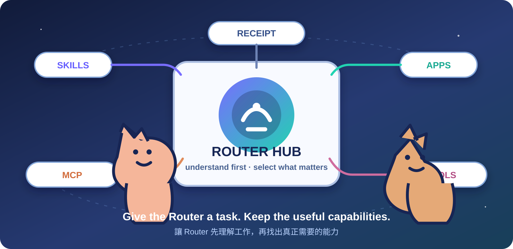
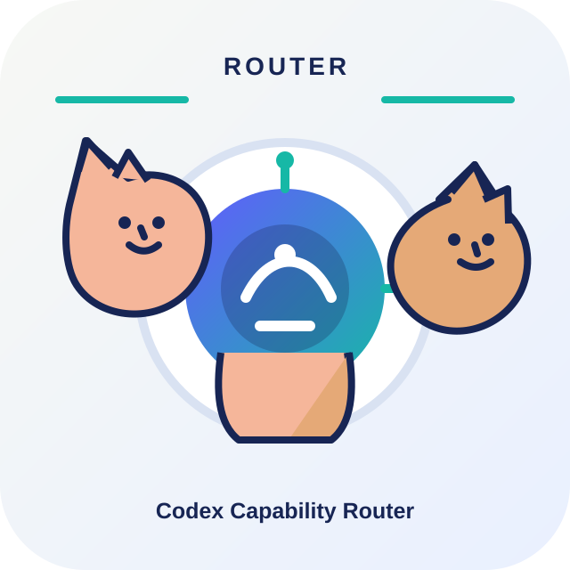
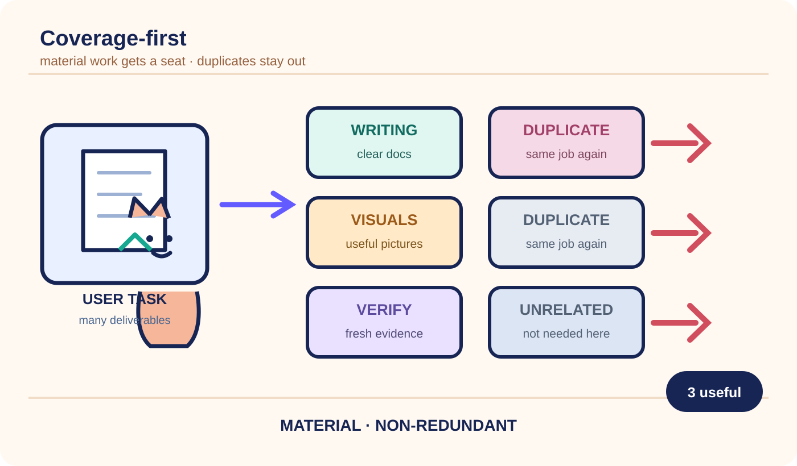
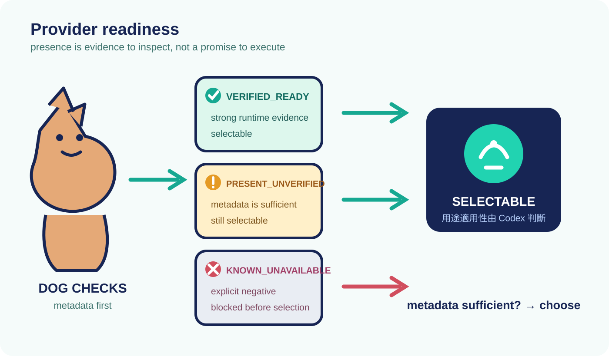
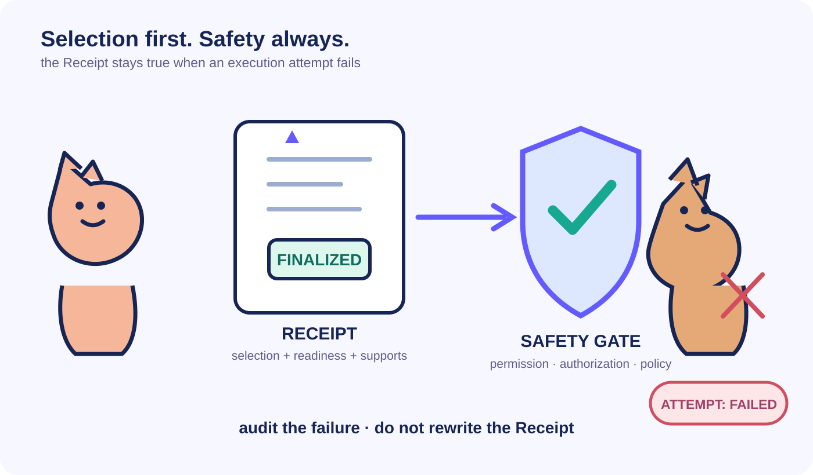
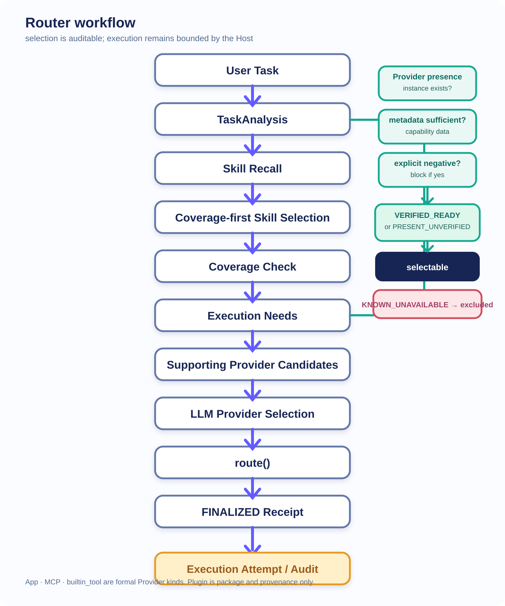

# Codex Capability Router

目前版本：<code>0.2.0-beta.1</code>

相容性基線：<code>0.1.0</code>；Phase 1 保持 <code>read-only</code>，不做 network discovery，也不輸出 private capability inventory。

繁體中文 | [English](README.en.md)

> 讓 Codex 先理解工作，再找出真正需要的 Skills 與 Supporting Providers。

Codex Capability Router 是一個 **local-first、context-first、read-only** 的能力路由器。它不是另一個執行 Agent，也不會代替 Codex 執行能力；它把一個完整任務整理成可稽核的 TaskAnalysis，交由 Codex 判斷方法型 Skill 與目前可用的 Supporting Provider，最後產生不會被執行失敗偷偷改寫的 Receipt。

## 這是什麼

Router 的工作很單純：

~~~text
Task understanding
→ Capability discovery
→ Skill selection
→ Supporting Provider selection
→ auditable Receipt
~~~

Python 只負責 schema、canonical identity、readiness、fingerprint、privacy 與 lifecycle validation。語意判斷仍由 Codex 完成；Router 不用 keyword-to-ID mapping，也不在 Python 裡偷偷建立第二套 semantic selector。

## 核心功能

| 區域 | 目前支援 |
| --- | --- |
| 任務與 Skill | <code>TaskAnalysis</code>、trusted-root Skill discovery、coverage-first selection、最多一次 bounded Coverage Check、material/non-redundant selection、full Skill handoff |
| Supporting Provider | lazy <code>Execution Needs</code>、正式 <code>App</code>、<code>MCP</code>、<code>builtin_tool</code>、<code>PRESENT_UNVERIFIED</code> optimistic selection、explicit-negative exclusion、capability metadata gate |
| 稽核與安全 | immutable <code>FINALIZED</code> Receipt、<code>ExecutionAttempt</code> audit、Plugin package/provenance boundary、privacy validation、content fingerprint、deterministic validation |

### Coverage-first Skill selection

Router 先看完整任務，再從 live candidate set 找出真正有用且彼此不重複的方法。選得少不代表漏選；重點是每個 material work item 都有合理 coverage。Coverage Check 是單一 bounded correction，不是無限擴張候選清單的入口。

### Provider readiness 與 optimistic selection

Provider 只有在 instance presence 與 capability metadata 足夠時，才有機會進入語意選擇。<code>PRESENT_UNVERIFIED</code> 仍可被 Codex 選取；<code>KNOWN_UNAVAILABLE</code>、explicit negative、metadata 不足或未 certification 的 instance 會在 selection 前排除。

### 安全執行與 Receipt

<code>route(SelectionRouteInput(...))</code> 會建立 <code>FINALIZED</code> Receipt。Receipt 記錄原始 selection、supports、readiness 與 execution needs；後續 execution attempt 的成功或失敗是獨立 audit outcome，不會回頭改寫原 selection。

## How it works

流程中的兩條邊界要分開看：Skill 告訴 Codex「怎麼做」，Supporting Provider 才代表 Host 當下「能不能執行」。<code>route()</code> 只接受通過 trust、handoff、metadata、fingerprint 與 lifecycle gate 的輸入，不會自行呼叫 Provider endpoint。

## Skill、Provider 與 Plugin

| 名稱 | 責任 | 是否是 formal selection |
| --- | --- | --- |
| Skill | 提供方法、準則與完整 handoff，告訴 Codex 怎麼完成工作。 | 是，作為 method Skill |
| Supporting Provider | 提供目前 Host 可呼叫的 runtime capability。 | 是，kind 只能是 <code>app</code>、<code>mcp</code> 或 <code>builtin_tool</code> |
| Plugin | 保存 package 與 provenance 邊界，可能暴露 App 或 MCP。 | 否，Plugin 永遠不是 formal Provider |

## Provider readiness

| 狀態 | 意義 | Selection |
| --- | --- | --- |
| <code>VERIFIED_READY</code> | 有較強的 runtime evidence、exact identity 與 callable surface。 | selectable |
| <code>PRESENT_UNVERIFIED</code> | instance 存在、capability metadata 足夠，但 readiness 尚未完成驗證。 | selectable |
| <code>KNOWN_UNAVAILABLE</code> | 已知不可使用，或通過明確 negative gate。 | excluded |

<code>selected</code> ≠ <code>guaranteed executable</code>。正式 route 會保留 readiness state；真正執行仍要遵守 Host permission、authorization、connection、policy 與 safety。

## 安裝

這個 repository 本身就是一個 Codex Skill source tree。Skill discovery 需要目標目錄下有 <code>SKILL.md</code>；目前沒有額外 Python dependency，也沒有 installer。Python 3.11 以上只在執行測試與本地驗證時需要。

### Windows / PowerShell

Step 1：確認 Git。

~~~powershell
git --version
~~~

Step 2：建立或確認 Skills 目錄。

~~~powershell
$skillRoot = Join-Path $env:USERPROFILE ".agents\skills"
$skillPath = Join-Path $skillRoot "codex-capability-router"
New-Item -ItemType Directory -Force -Path $skillRoot | Out-Null
~~~

Step 3：將 repository clone 到正確的 Skill path；已存在的 clone 使用 fast-forward only 更新。

~~~powershell
if (Test-Path (Join-Path $skillPath ".git")) {
    git -C $skillPath pull --ff-only
} else {
    git clone https://github.com/Lzxpan/codex-capability-router.git $skillPath
}
~~~

Step 4：確認 <code>SKILL.md</code> 存在。

~~~powershell
Test-Path (Join-Path $skillPath "SKILL.md")
~~~

Step 5：若目前 Codex session 已經載入舊的 Skill inventory，重新開啟適當 session，讓新的 Skill 被發現。

Step 6：在 repository checkout 內執行最小 verification。

~~~powershell
python -m unittest discover -s tests -p "test_*.py"
python -m compileall -q codex_capability_router tests
~~~

### macOS / Linux

Step 1：確認 Git。

~~~bash
git --version
~~~

Step 2–3：建立 Skills 目錄並 clone 或 fast-forward 更新。

~~~bash
skill_root="\${HOME}/.agents/skills"
skill_path="\${skill_root}/codex-capability-router"
mkdir -p "$skill_root"
if [ -d "$skill_path/.git" ]; then
  git -C "$skill_path" pull --ff-only
else
  git clone https://github.com/Lzxpan/codex-capability-router.git "$skill_path"
fi
~~~

Step 4：確認 <code>SKILL.md</code> 存在。

~~~bash
test -f "$skill_path/SKILL.md"
~~~

Step 5：若 Codex session 已快取舊 inventory，重新開啟 session。

Step 6：執行最小 verification。

~~~bash
python3 -m unittest discover -s tests -p 'test_*.py'
python3 -m compileall -q codex_capability_router tests
~~~

## 更新

在已 clone 的 Skill repository 內使用：

~~~bash
git pull --ff-only
~~~

不要以手動複製覆蓋現有 Skill；若目錄不是 Git clone，先保留它並另行確認安裝範圍。

## Quick Start

把自然語言任務交給 Codex，讓 Router 依任務內容與可信 inventory 決定 coverage。範例不需要指定 Skill ID 或 Provider ID。

### A. 簡單任務

~~~text
請讀取這個 repository 的設定檔，整理三個最重要的限制，先不要修改檔案。
~~~

Router 應保留最少但足夠的 explanation 或 inspection coverage，不為了湊數量加入無關能力。

### B. 複雜工程任務

~~~text
請追蹤一個 parser 的輸入驗證、錯誤路徑與測試，整理成繁中技術說明，並指出哪些結論只有來源碼依據。
~~~

Router 可以選擇互補的 code explanation、verification 與 technical writing 方法；重疊的 Skill 不應同時入選。

### C. 需要外部 execution capability 的任務

~~~text
請檢查目前 repository 的測試與編譯狀態；若需要 Host 的外部 runtime，先列出實際可用能力與 readiness，再執行必要的唯讀檢查。
~~~

Router 先建立 <code>Execution Needs</code>，再讓 Codex 從 formal App、MCP 或 builtin tool candidates 中選擇。出現一個 Provider 不代表它一定能完成整個工作。

## Receipt example

以下是 sanitized example，不是某次使用者任務的原始輸出：

~~~json
{
  "task_summary": "Explain and verify a bounded repository change",
  "selected_skills": ["documentation-method", "verification-method"],
  "supporting_providers": [
    {"kind": "builtin_tool", "readiness": "VERIFIED_READY"}
  ],
  "status": "FINALIZED",
  "fingerprint": "sha256:0123456789abcdef0123456789abcdef0123456789abcdef0123456789abcdef"
}
~~~

Receipt 不包含 private path、credentials、hidden prompt 或 chain-of-thought。正式 output 會保留 provenance、supports、readiness 與必要的 audit fields。

## Safety / Design boundaries

- 沒有 Python semantic routing；Python 只做 deterministic validation。
- 沒有 keyword-to-ID mapping、silent fallback 或固定 Skill count。
- Plugin 是 package/provenance container，不是 formal Provider。
- 正式 Provider kind 是 <code>app</code>、<code>mcp</code>、<code>builtin_tool</code>；raw tool endpoint 不能越過 formal boundary。
- Execution 仍需要正常 permission、authorization、connection、policy 與 safety。
- <code>FINALIZED</code> selection 不會因 execution failure 被偷偷改寫；需要新決策時建立新的 route。

## Current limitations

- Optimistic Provider Core 已由 deterministic regression 測試覆蓋，包含 <code>PRESENT_UNVERIFIED</code> selectable path 與 explicit-negative exclusion。
- Installed smoke path 與 <code>builtin_tool</code> 的 <code>functions.exec_command</code> <code>VERIFIED_READY</code> positive path 已驗證；本次 README acceptance 也使用正式 <code>route()</code> 產生 Receipt。
- 本 Host 的官方 App Server surface 未提供可連線的 live inventory，因此 App/MCP live acceptance 維持 Host-surface blocked。App adapter、MCP adapter 與 readiness contract 有測試，但不宣稱所有 App 或 MCP live tested。
- 本 repository 不執行 Provider endpoint，不自動安裝、登入、授權或管理 Plugin/Skill；實際執行結果必須另行記錄為 <code>ExecutionAttempt</code>。
- 本 README 的六張圖是 repository 內原創 SVG；本次沒有使用外部圖片、stock image、watermark 或外部載入資源。

## Tests

目前 repository regression：**165/165 PASS**。

~~~bash
python -m unittest discover -s tests -p "test_*.py"
python -m compileall -q codex_capability_router tests
~~~

測試涵蓋 TaskAnalysis、trusted-root discovery、Skill coverage、optimistic Provider readiness、official adapter gate、Plugin boundary、Receipt finalization 與 execution outcome contract。實際最新結果應以你執行上述命令時的輸出為準。

## 相關文件

- [Skill contract](SKILL.md)
- [繁中 v0.2 user guide](docs/v0.2_user_guide.zh-TW.md)
- [License](LICENSE)

## License

MIT，詳見 [LICENSE](LICENSE)。
