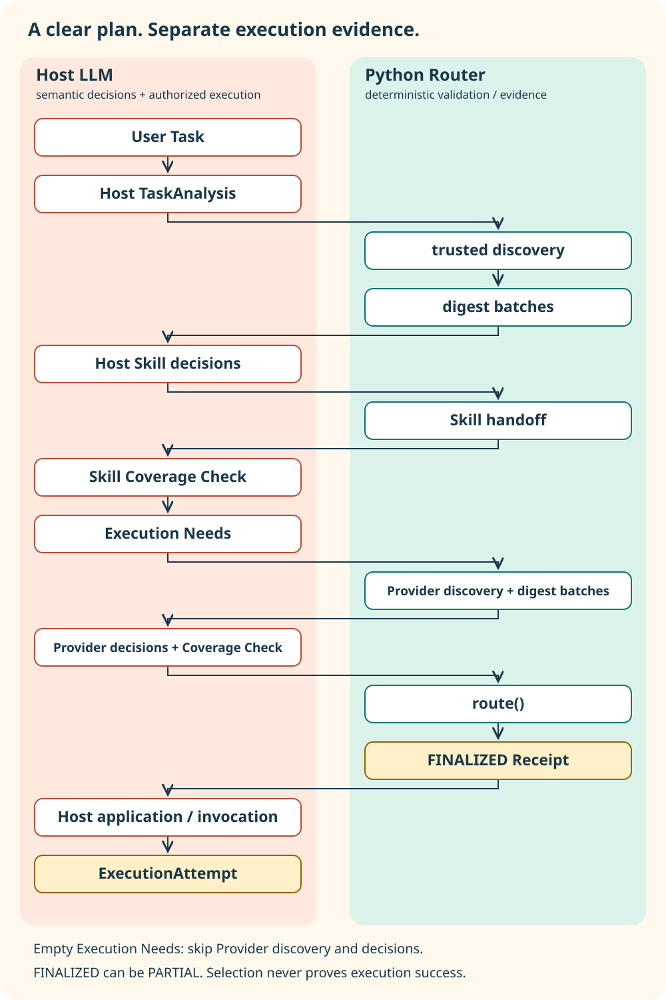

# Codex Capability Router

**讓任務找到合適的 Skills 與 Tools。**

繁體中文 | [English](README.en.md)


[](CHANGELOG.md)
[](pyproject.toml)
[](LICENSE)

**目前版本：`v1.0.1` Stable。** 如果某類工作你常手動補同一個 Skill，Router 可以記住這個習慣，下次相似工作自動補選。這項功能稱為 [Skill Preference Memory](#skill-preference-memoryv101)，保留 v1.0.0／`v0.2.0-beta.10` 的正常 semantic selection 與安全驗證。

你已經有很多 Skills 和工具，但每個任務都不一樣。修 firmware、整理 README、產生圖片、檢查測試，往往需要幾種能力一起合作。

**Codex Capability Router 是提供給 Codex／Host 的 read-only routing 與 Skill 指引。** 它整理可信來源中的能力，把候選交給 Host LLM 判斷，再驗證選擇、交接完整指令，留下可追溯的 Receipt。Host 指承載模型並實際操作工具的應用程式。

## 從這裡開始

需要 **Git、Python 3.11+**，以及能讀取 Skills 的 Codex／Host。Python runtime dependencies 為空。

### 安裝

以下是全新安裝；目標資料夾已存在時，Git 會拒絕覆蓋，請先確認既有安裝。

以下指令安裝 Stable v1.0.1，包含 Skill Preference Memory。

**Windows PowerShell**

```powershell
$skillRoot = Join-Path $HOME ".agents/skills/codex-capability-router"
git clone --branch v1.0.1 --depth 1 https://github.com/Lzxpan/codex-capability-router.git $skillRoot
if ($LASTEXITCODE -ne 0) { throw "Installation failed" }
```

**macOS / Linux**

```bash
skill_root="${HOME}/.agents/skills/codex-capability-router"
git clone --branch v1.0.1 --depth 1 https://github.com/Lzxpan/codex-capability-router.git "$skill_root"
```

讓 Host 重新載入 Skill 清單，再在 prompt 中使用：

```text
$codex-capability-router
請先分析這次任務，找出合適的 Skills 與 Providers：
幫我整理專案 README、製作圖解，並驗證內容與程式一致。
```

**看 Receipt 時先問三件事：選了什麼？候選是否都收到判斷？真正執行的結果在哪裡？**
`FINALIZED` 代表選擇紀錄已定案；工作是否成功，要另外看 Host 的執行證據。

安裝提供的是指令層整合。每個任務是否自動觸發 Router、能否取得完整 inventory、會不會實際套用 Skill，取決於 Host 接線；**不宣稱 automatic Host integration 已在所有環境成立**。整合端 API 與範例見[目前 contract](references/routing-policy.md)。

## 一個任務，怎麼找到幫手？

故事主角是兔子開發者；青綠背心的水獺是 Router 引導角色，黃色工作服的貓頭鷹代表工具檢查與 Verification。角色是流程的視覺比喻；語意判斷實際由 Host LLM 完成。


依每格左上角的數字閱讀：第一張 `1–4`，第二張接續 `5–8`。每張皆為左上、右上、左下、右下：

1. **好多能力，從哪裡開始？** 想完成一份專案說明，眼前卻是一整桌 Skills 與 Tools。
2. **先理解 Task。** Host 建立 TaskAnalysis，拆出工作、交付物、限制與品質要求。
3. **打開可信的工具櫃。** Router 發現 Skills 與可用來源，整理成 digest batches；排入批次還不代表已被語意考慮。
4. **Host 逐批判斷。** 模型根據任務決定每個候選是否有用，相關方法即使重疊也可以一起保留。


5. **方法讀完整，再補缺口。** 完整 Skill handoff 與一次 bounded Skill Coverage Check 之後，Host 建立 Execution Needs；有需要才判斷 Providers。
6. **先把計畫定案。** Python 驗證 `route()` 輸入並產生 `FINALIZED` Receipt。圖中的封存資料夾記錄選擇，還不是成功證書。
7. **真正開始工作。** Host 在原有授權下套用方法、呼叫工具，完成文件、圖像或程式工作。
8. **看結果，留下證據。** Verification 檢查實際輸出；獨立的 `ExecutionAttempt` 記錄執行結果，與選擇 Receipt 分開。

## 四個原則


| 原則 | 實際做法 |
| --- | --- |
| **1. DISCOVER BROADLY** | 從明確可信 roots 與 Host metadata 發現能力，保留來源；不任意掃描整顆硬碟。 |
| **2. CONSIDER BROADLY** | 讓 present、identity 已解析的候選進入批次。描述為 `SPARSE`／`OPAQUE` 也可保留；staged != semantically considered。 |
| **3. SELECT GENEROUSLY** | 不使用 fixed top-k，不設 fixed Skill maximum；overlap／redundancy 不是自動排除理由。有 plausible task-relevant value 就可選。 |
| **4. EXECUTE CAREFULLY** | 選取不等於授權、可呼叫或成功。Host 執行時仍遵守權限、連線、刪除、傳送與發布邊界。 |

## Skill、Provider、Plugin 各做什麼？

| 名稱 | 可以把它想成 |
| --- | --- |
| **Skill** | 一本工作方法：如何 debug、寫文件、review 或驗證。Host 讀取完整指令後實際套用。 |
| **Provider** | 執行能力的來源：`app`、`mcp`、`builtin_tool`、`host_tool`。存在與 readiness 分開記錄。 |
| **Plugin** | 裝著 Skills、Apps 或 MCP 的套件與 provenance container。**Plugin 不是 Provider。** |
| **Host LLM** | 理解任務、判斷相關性、提出 Execution Needs 的決策者。 |
| **Python Router** | 負責 deterministic discovery、validation、fingerprints、handoff 與 evidence；不替模型做 semantic decisions。 |

無法確認 Host hierarchy 的工具保留為 `host_tool`，不猜成 App 或 MCP。已安裝、已選到、已授權、已呼叫與已成功，都是不同狀態。

## 實際工作會怎麼幫忙？

### Firmware debugging / implementation
「停止出水後，面板燈還亮著。」Host 可以組合 firmware 分析、狀態機追查與 regression 方法，再選取讀檔、build 或 log 工具。Receipt 說明選了什麼；source tests 通過不等於已完成燒錄或硬體驗證。

### 文件、README、圖像製作
「讓第一次看到專案的人看懂它。」Host 可以同時保留技術寫作、視覺敘事、圖像生成與雙語檢查方法，配合 image／diagram tools 完成交付。方法選對了，還要實際看圖、檢查連結與核對事實。

### 測試、code review、verification
「這個版本可以發布了嗎？」Host 可以組合 code review、測試與發布檢查方法，把觀察到的結果連回要求；遇到缺失證據，就清楚標出尚未驗證的部分，而不是把選擇完成當作測試通過。

## 架構：誰判斷，誰驗證？



珊瑚色表示 **Host LLM = semantic decisions**；青綠色表示 **Python Router = deterministic validation / evidence**。黃色紀錄把 selection 與 execution 分開。

流程保留 TaskAnalysis → trusted discovery → digest batches → Host Skill decisions → Skill handoff / Coverage Check → Execution Needs → Provider decisions → `route()` → FINALIZED Receipt → Host execution → ExecutionAttempt。Execution Needs 為空時跳過 Provider 路徑；Supporting Coverage Check 最多一次。

可版本控制的 [Mermaid source](docs/assets/v1.0.0/architecture.mmd) 與 [SVG](docs/assets/v1.0.0/architecture.svg) 隨 repo 提供，不需要 Figma 帳號即可閱讀。

## Receipt 怎麼讀？

| 欄位／狀態 | 能證明什麼 |
| --- | --- |
| `STAGED` | 已排入批次的候選數。 |
| `DECISION_RECEIVED` | 已收到且驗證有效的 Host disposition 數。 |
| `SEMANTICALLY_CONSIDERED` | 已有 `selected` 或 `not_selected` 判斷的候選數。 |
| `NEVER_CONSIDERED` | 尚未收到 Host 回覆的候選數。 |
| `UNRESOLVED` | 尚未回覆，或仍停在 `needs_detail` 的候選數。 |
| `COMPLETE` / `PARTIAL` | 本次提供的候選是否全部有明確判斷。不是全世界能力的 discovery 完整性，也不是模型判斷正確率。 |
| `FINALIZED` | selection Receipt 已驗證並凍結；可同時是 `PARTIAL`。**FINALIZED != execution success。** |
| `ExecutionAttempt` | Host 另外記錄的執行結果，不能從 Receipt 自動推定。 |

例如，一批候選完全沒收到回覆，就仍是 `PARTIAL`，不能把 staged count 當作 considered count。Host batch decisions 必須綁定 task／sweep fingerprints 與 batch index；缺整批保留 PARTIAL，批內缺項或矛盾結果會被拒絕。

## Skill Preference Memory（V1.0.1）

Memory 記住「工作類型 → 使用者偏好的 Skill」。下次相似工作若正常選取尚未包含它，Host 可依偏好補入，並標記為 `MEMORY_ADDED`。

| 工作類型 | 使用者常手動補選的 Skill | 下次相似工作 |
| --- | --- | --- |
| 修改程式 | `code-comments` | 未選到時可依偏好補入 |
| 繁體中文文件／說明 | `humanizer-zh` | 未選到時可依偏好補入 |
| 完成實質專案工作 | `work-log` | 未選到時可依偏好補入 |

這些只是使用習慣的例子，不是預植規則或預先建立的記憶。Host LLM 負責判斷通用 task pattern、哪些使用者要求值得記憶，以及新工作是否相似。Python 不做 keyword → Skill mapping，也不以固定次數門檻決定偏好。

### 使用流程

```text
User Task
→ Normal Skill Selection
→ Freeze Base Selection
→ Load Skill Preference Memory
→ Host 判斷適用偏好
→ Memory Additions
→ Validation / Handoff
→ FINALIZED Receipt
```

Host 先完成 TaskAnalysis、discovery 與正常 batch decisions，凍結 base selection 後才首次讀取 preference snapshot。Memory 只補選，不取代正常 semantic selection，也不改寫原始 batch dispositions 或計數，因此不污染 `MODEL_SELECTED` 的來源紀錄。

使用者本輪明確指定／排除優先。已選到的 Skill 不會重複加入；每個 Memory addition 仍須通過 identity / eligibility / handoff / freshness validation。Memory 損壞、Skill 不存在或補選不安全時，留下診斷並繼續正常 routing；原始選取的安全錯誤仍會失敗。Memory 空白或關閉時保留原有 Receipt 與 fingerprint。

`preference_evidence` 說明選取來源（provenance）：

| 來源 | 意義 |
| --- | --- |
| `MODEL_SELECTED` | 正常 semantic selection 本身選到的 Skill。 |
| `USER_SPECIFIED` | 使用者本輪明確指定或手動補選。 |
| `MEMORY_ADDED` | base selection 凍結後，依過去使用者偏好補入。 |

**`MEMORY_ADDED` 不代表已執行成功。** 例如選到 `work-log`，仍需由 Host 實際套用方法並另外提供執行證據。

### 記什麼，存在哪裡？

只記 Skill 選用偏好，不記工作內容：不保存 raw prompt、source code、bug、solution、project details、private paths、credentials 或 hidden reasoning。

使用者起始指定（`USER_SPECIFIED`）與後續手動補選（`USER_MANUALLY_ADDED`）可交由 Host 判斷是否形成偏好。`MODEL_SELECTED` 不會建立使用者偏好；已確認實際使用的 Memory addition 只更新既有關聯日期，不增加使用者訊號次數。Controller／routing-support Skill（包括 Router 本身）不會被學成偏好：學習 API 使用當輪 `skill_inventory` 與 production eligibility 逐筆檢查，同批合法偏好仍可更新，inventory 不會持久化。

預設本機位置為 `$CODEX_HOME/capability-router/skill-preferences.json`；未設定 `CODEX_HOME` 時，使用 `$HOME/.codex/capability-router/skill-preferences.json`。JSON 只存 `task_pattern`、`preferred_skill_id`、`learned_from`、`use_count`、`last_used`、`enabled`，最多 256 筆／256 KiB，保留至刪除。沒有 cloud memory，也不混入 Skill inventory cache。

可直接用文字編輯器查看 JSON，或由能匯入本套件的 Host 使用以下管理操作。`key` 是檔案內某筆既有的 `(task_pattern, preferred_skill_id)`；`None` 表示使用預設位置。

| 操作 | API |
| --- | --- |
| 查看 | `load_preferences().to_mapping()` |
| 停用單筆 | `set_preference_enabled(None, key, False)` |
| 重新啟用單筆 | `set_preference_enabled(None, key, True)` |
| 刪除單筆 | `clear_preferences(key=key)` |
| 全部清除 | `clear_preferences()` |

停用會保留資料，學習流程不會自行重新啟用；清除會移除關聯。Host 應檢查更新結果的 `written` 與 `diagnostics`。`route()` 保持唯讀：Host 在 base selection 完成後呼叫 `load_preferences()`，以 `SkillPreferenceInput` 傳入適用關聯；學習另呼叫 `update_preferences()`。Host 也須在寫入前確認 pattern 不含專案或私人語意，格式檢查無法代替這項判斷。

本版已有獨立 Host 跨任務 recall 驗收；其他 Host 仍需依此流程接入讀取、比對與輸入建構，不宣稱每個環境都會自動觸發。詳細 [API 與資料契約](references/routing-policy.md#skill-preference-memory-v101)及[驗收邊界](docs/validation/v1.0.1-validation.md)另列。V1.0.0 圖解保留原始 routing 流程，本節補充偏好階段。

## 安全邊界與已知限制

- **唯讀 Router。** 不執行工具、不安裝能力、不進行 network discovery，也不替 Host 授權；不應輸出 private capability inventory、credentials、private paths 或 hidden reasoning。
- **只走可信來源。** 明確 roots、受控的 `.system` child、已解析的 active Plugin paths 與可信 Host snapshot；不是無界遞迴掃描。
- **一次 targeted Skill freshness recovery。** Handoff 檢查實際選定來源的內容。最多一次 refresh；公開 metadata／identity 改變時要求 `SELECTION_REVALIDATION_REQUIRED`，再度 mismatch 則回傳 `HANDOFF_REJECTION_AFTER_ONE_REFRESH`。
- **caller/session-owned cache。** `RootPlanSnapshot` 與 `SkillInventorySnapshot` 的生命週期由呼叫端管理；persistent preference learning 由獨立 Host-called local storage API 提供，不混入 inventory cache，也不會背景學習。
- **Host integration 有範圍。** Presence 不保證 readiness。完整 inventory、模型判斷品質、各 Provider 執行與硬體結果，需要各自的實測證據。
- **既有 Provider diagnostic 限制。** 準備階段的 `provider_selected_total` 可能與最終 `selected_count`／Provider 清單不同；以 finalized selection 清單為準，本版保留這項 diagnostic inconsistency。

## 維護與驗證

```bash
python -m unittest discover -s tests -q
python -m compileall -q codex_capability_router tests
python scripts/verify_release.py
```

macOS／Linux 若使用 `python3`，將上面的 `python` 改為 `python3`。

目前 contract 在 beta.10／V1.0 正常 routing 基礎上加入 Skill Preference Memory；`0.1.0` 相容性與歷史 beta 資料仍保留，歷史欄位不能取代目前 selection contract。

[CHANGELOG](CHANGELOG.md) · [正式版驗證說明](docs/validation/v1.0.1-validation.md) · [發布說明](docs/releases/v1.0.1.md) · [Discovery](references/discovery-and-provenance.md) · [Routing contract](references/routing-policy.md) · [MIT License](LICENSE)
