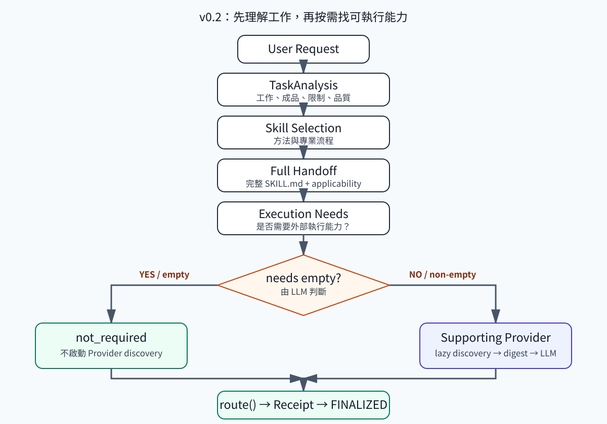
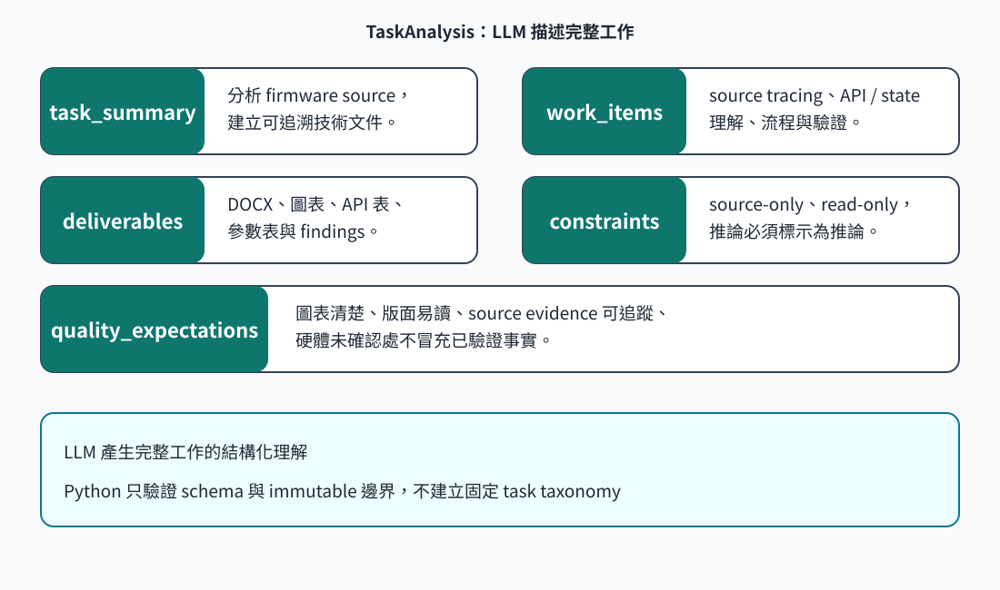
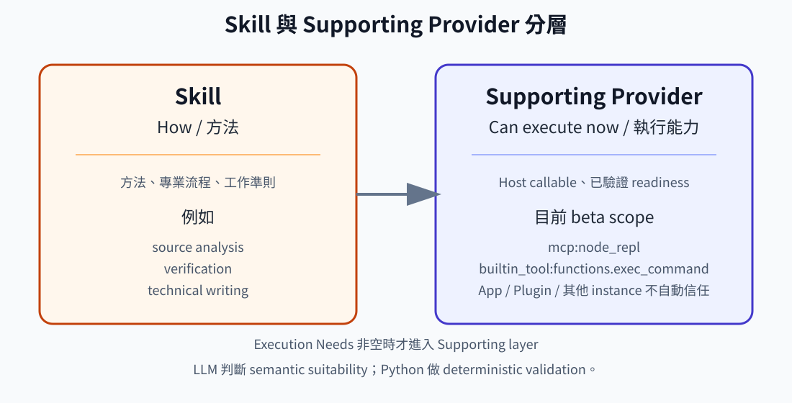
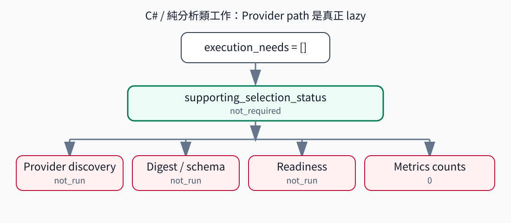
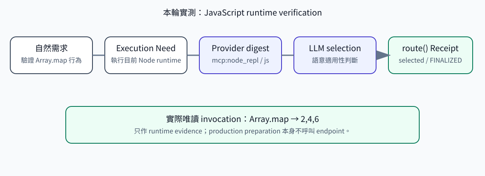
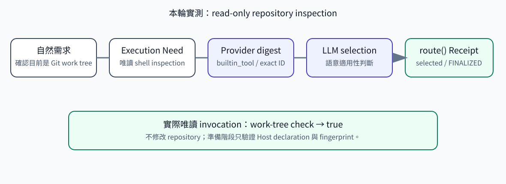
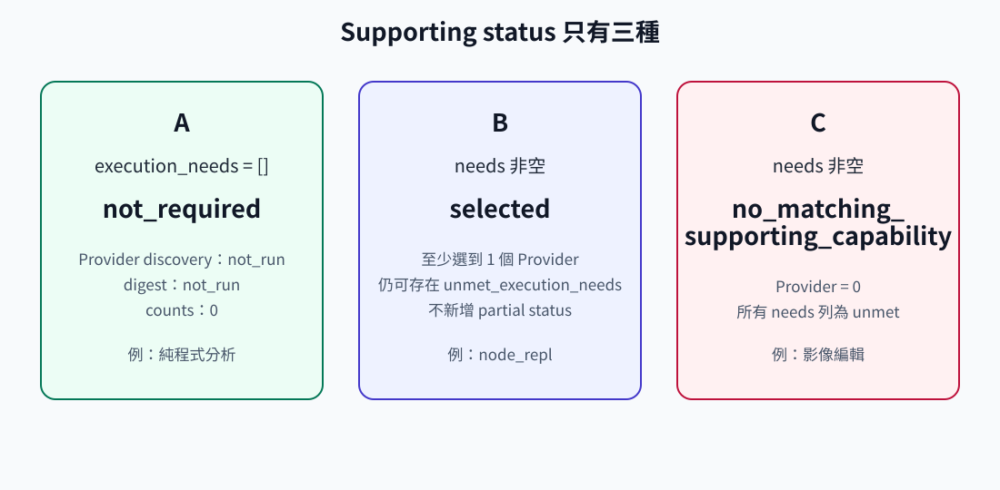
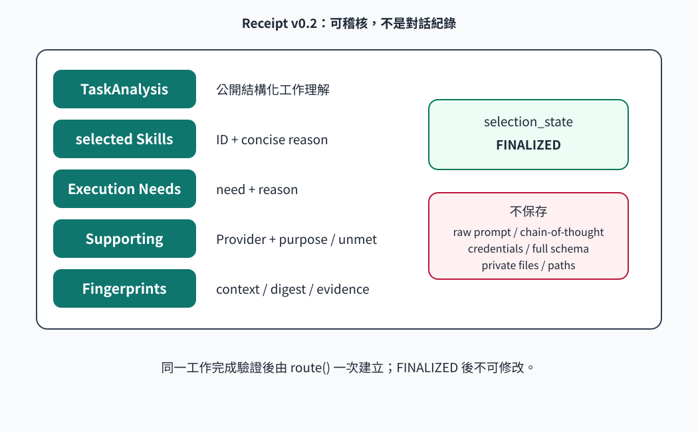

# codex-capability-router v0.2.0-beta.10 使用說明

本頁前半部是目前操作規則。下方保留的早期 v0.2 實測只供歷史參考；其中 limited Provider scope、runtime availability gate 與測試數量不適用於 beta.10。

## 目前的接入方式

1. Host 產生 `TaskAnalysis`，提供可信 Skill roots / snapshot 給 `prepare_route_context()`。
2. Host 讀取 `skill_context.inventory_sweep.batches` 與候選 digests，逐批作語意判斷，再完成 selected Skill 的完整指令 handoff 與最多一次 Coverage Check。
3. Host 產生 `ExecutionNeed`。needs 非空才準備 `prepare_supporting_context()` 並逐批判斷 Provider；空 needs 維持 lazy `not_run`。
4. Host 將目前 selection、兩個 contexts、可信來源和 batch responses 傳入 `route(SelectionRouteInput(...))`。Python 驗證 task / snapshot / identity / selection 的一致性。
5. Receipt 可以是 `FINALIZED` 且 coverage `PARTIAL`。Host 另外負責套用規則、實際呼叫與 `ExecutionAttempt`，selected 不等於已使用。

### Host batch response

以下是已取得 Host 判斷後的組裝方式；`host_dispositions` 必須來自實際判斷，不能由 Python 依 final selected IDs 自動補造：

```python
response = {
    "task_fingerprint": skill_context.context_fingerprint,
    "sweep_fingerprint": skill_context.inventory_sweep.fingerprint,
    "batch_index": 0,
    "dispositions": host_dispositions,
}
# Pass a tuple of responses as SelectionRouteInput.skill_batch_decisions.
# For supporting_batch_decisions, use supporting_context.inventory_sweep.fingerprint
# and the same skill_context.context_fingerprint as task_fingerprint.
```

每個 batch 的 ID 必須完全一致，disposition 只能是 `selected`、`not_selected`、`needs_detail`。缺少整批保持 PARTIAL；批內缺項、額外 ID、重複批次、矛盾 selection 與過期 task / snapshot 會被拒絕。Provider sweep 還綁定 Execution Needs。

準備 500 digests、尚無任何回覆時，staged 是 500，decision received 是 0。全部回覆且沒有 `needs_detail` 才能 COMPLETE；這仍不是自然語言選擇品質或全機 discovery 的證明。

## 目前選擇與安全邊界

Skill 與 Provider 都使用 plausible relevance；overlap、metadata 稀疏與 readiness negative 不會把已存在且 identity resolved 的候選藏起來。正式 Provider kinds 是 `app`、`mcp`、`builtin_tool`、`host_tool`。Plugin 是 provenance；早期文件中的兩個 certified instances 並非目前的選取上限。

Selected Skill 的 source fingerprint 改變時只刷新該 Skill 一次；metadata / identity 變更要求重新 selection，第二次 mismatch 拒絕。Router 不自行增加 retry、權限、外部寫入或記憶學習。

安裝只提供 Skill 指令，完整自動觸發仍需 Host 接入。[README](../README.md)、[normative routing policy](../references/routing-policy.md) 與 [beta.10 驗證紀錄](validation/v0.2.0-beta.10-validation.md) 描述目前能力；real Provider、完整 Host 自動流程、自然語言盲測與硬體仍需各自驗證。

## 歷史 v0.2 指南與當時實測（不適用於目前 contract）

以下原文保留早期版本的觀測、範例與圖示，不作 beta.10 的規則或驗收證據。

# codex-capability-router v0.2 使用說明

本指南面向第一次使用 `codex-capability-router` 的 Codex 使用者與工程師。它說明 Router 如何理解工作、何時選 Skill、何時才尋找可直接呼叫的 Supporting Provider，以及如何閱讀最後的 Receipt。

> 圖示說明：架構與欄位圖是 **Conceptual illustration**；`node_repl`、`functions.exec_command` 圖中的結果來自本輪安裝版實測。文件不包含 prompt 原文、私人推理、憑證或私人路徑。

## 1. 它到底做什麼？

Router 把一個完整工作拆成兩個不混合的問題：

- **Skill（方法）**：這個工作應該怎麼做？例如 source analysis、verification、technical writing。
- **Supporting Provider（執行能力）**：目前 Host 有什麼已驗證、可以直接呼叫的能力？例如目前 beta scope 的 `mcp:node_repl` 與 `builtin_tool:functions.exec_command`。

LLM 負責理解需求與判斷語意適用性；Python 只負責 strict schema、canonical ID、readiness、fingerprint、privacy 與 lifecycle validation。兩者不放進同一個排名清單。

## 2. v0.2 完整流程



流程順序是：

1. LLM 先產生 immutable **TaskAnalysis**。
2. Router 準備 Skill-only context，LLM 再選方法 Skill，並完成 full handoff / applicability check。
3. LLM 從 TaskAnalysis 與 Skill 結果判斷 **Execution Needs**。
4. 只有 needs 非空才進入 Supporting Provider discovery、hard eligibility、digest 與 supporting selection。
5. 最後只有既有 production `route()` 能建立 Receipt 並進入 `FINALIZED`。

## 3. TaskAnalysis 怎麼看？



TaskAnalysis 是 LLM 對完整工作的精簡結構化理解，不是固定 taxonomy：

| 欄位 | 用途 |
| --- | --- |
| `task_summary` | 一句話描述整體工作。 |
| `work_items` | 要完成的子工作，可自然列出多項。 |
| `deliverables` | 使用者要收到的成品或 findings。 |
| `constraints` | read-only、不得生成、來源限制等明確邊界。 |
| `quality_expectations` | 可讀性、可追溯性、驗證要求等品質期待。 |

Python 只驗證欄位完整、型別、長度、敏感資料與 immutable；不把欄位轉成 `DOCUMENT_TASK` 或 `IMAGE_TASK`。

## 4. Skill 與 Supporting Provider 的差別



Skill 回答「方法與準則」，Provider 回答「現在能不能直接執行」。例如技術文件 Skill 可以指導文件結構，但不代表目前一定有 DOCX 編排工具。Provider 必須先通過 Host runtime evidence certification，LLM 才能從 hard-eligible digest 中判斷是否適用。

目前正式 beta scope 僅為：

- `mcp:node_repl`
- `builtin_tool:functions.exec_command`

App 是 `INSUFFICIENT_RUNTIME_EVIDENCE`，Plugin 是 `NO_RUNTIME_SAMPLE`；其他 MCP / builtin tool 不會因為名稱或 kind 相同就自動被信任。

## 5. Lazy Supporting Path



如果 `execution_needs=[]`，Supporting path 完全不執行：不 discovery、不做 readiness、不建 digest、不讀 tool schema，metrics 也保持 `not_run` 與 0。這是一般程式分析或只需要方法建議的常見路徑。

## 6. 正向 Provider 選取

### 6.1 `node_repl`



本輪實測以自然語言要求驗證 JavaScript 行為，實際唯讀執行結果為 `2,4,6`。`node_repl` 的選取由 LLM 語意判斷，Python 只確認 exact canonical identity、readiness certificate、digest 與 fingerprint。

### 6.2 `functions.exec_command`



本輪實測以自然語言要求確認 repository 是 Git work tree，唯讀檢查結果為 `true`。這不代表所有 shell 或其他 builtin tool 都自動可選；目前只接受已 certification 的 exact provider-equivalent identity。

## 7. No-match 是正常結果



沒有適合的 Provider 不等於 Router 壞掉。正式結果是：

```text
supporting_selection_status = no_matching_supporting_capability
unmet_execution_needs       = [仍未滿足的 need/reason]
```

Router 不會 silent fallback，也不會因為 App、Plugin 或未 certification 的 Provider 出現在電腦裡就猜測可用。

## 8. Receipt 有什麼用途？



Receipt 是一次正式決策的公開、可稽核摘要，至少可看到：

- TaskAnalysis
- selected Skills 與簡短理由
- Execution Needs
- selected Supporting Provider 或 unmet needs
- Skill / Supporting context 與 digest fingerprints
- metrics、readiness / provenance 摘要
- `selection_state=FINALIZED`

Receipt 不是對話紀錄。它不保存 raw prompt、chain-of-thought、完整 SKILL.md、完整 tool schema、credentials、私人檔案內容或私人絕對路徑。`FINALIZED` 後不能修改；新工作必須建立新的 Route。

## 9. 五個可直接複製的使用範例

以下範例刻意使用自然語言，不要求使用者手動指定 Provider。

### 程式分析

```text
請閱讀這個 C function，說明資料流、錯誤處理與邊界條件。只根據實際 source，不要修改檔案，最後列出仍需驗證的假設。
```

### JavaScript runtime verification

```text
請驗證這段純 JavaScript 在目前 Node runtime 的實際行為，回報觀察到的輸出與簡短解釋。只做唯讀執行，不修改 repository。
```

### Repository read-only inspection

```text
請唯讀檢查目前 repository 的結構與 Git 狀態，指出可追溯的檔案數量與任何明顯缺漏；不要修改檔案或設定。
```

### Image-edit requirement（預期 no-match）

```text
請修改既有圖片的局部幾何與遮罩，禁止 image generation，並保留原始解析度與可逆性。
```

### Mixed Skill + Provider task

```text
請先分析這段資料處理程式，再以目前 runtime 做一次唯讀行為驗證，整理成可追溯的 findings；不得修改 source。
```

## 10. Readiness 與安全邊界

「工具出現在電腦裡」不等於「Router 可以相信它」。Provider 必須有 Host 可觀測的 exact identity、callable exposure、schema 與已驗證 evidence fingerprint。`prepare_supporting_context()` 只讀 declarations，不執行 Provider endpoint，也不是 health-check subsystem。

目前限制：

- Host 在本輪仍未提供 Router 可採信的 Skill availability declaration，因此 Skill 可能如實回報 `no_matching_skill`。
- Supporting formal scope 只限 `node_repl` 與 `functions.exec_command`。
- App：`INSUFFICIENT_RUNTIME_EVIDENCE`。
- Plugin：`NO_RUNTIME_SAMPLE`。
- 其他 MCP / builtin provider 不自動信任。
- detail expansion 有 deterministic protocol coverage，但本輪實測未自然觸發。
- 為安全起見，未進行破壞性的 live stale mutation。

## 11. `explain-code` 相容性修正

v0.2 對舊 frontmatter 提供 bounded normalization：保留安全 scalar / block、簡單 `allowed-tools` list 與 `metadata.source_frontmatter` 一層 scalar leaves。實測 `explain-code` 已能正常 discovery、canonical ID 為 `explain-code`，並可建立 profile；但因 runtime availability 仍是 unknown，Router 不會假裝它 available，也不會進入 handoff。

## 12. 實測與文件邊界

本輪 7 案的結果詳見 [安裝版 Skill Live Test Report](v0.2_installed_skill_live_test_report.zh-TW.md)。測試報告記錄公開欄位、counts、status、fingerprints 與 privacy 結果，不記錄私人推理。圖檔皆為 SVG，使用 GitHub 相對路徑，可直接檢視。
